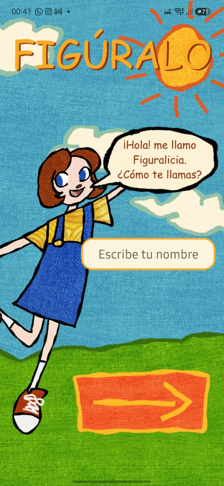
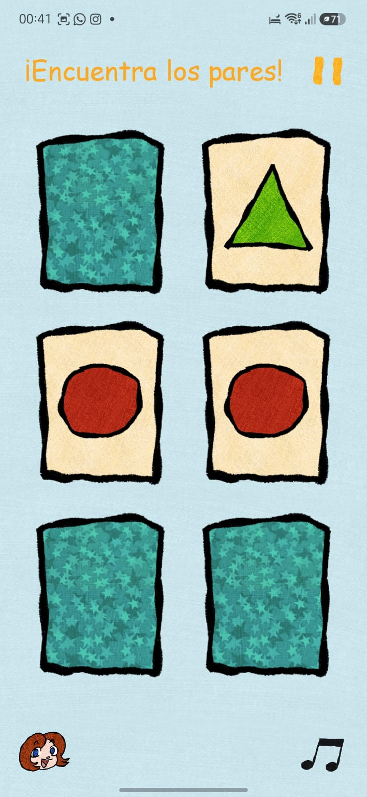
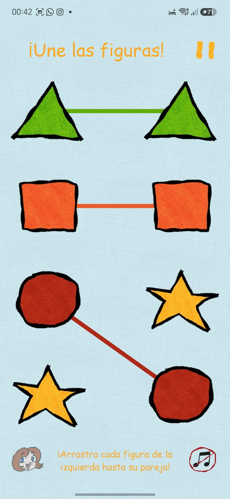
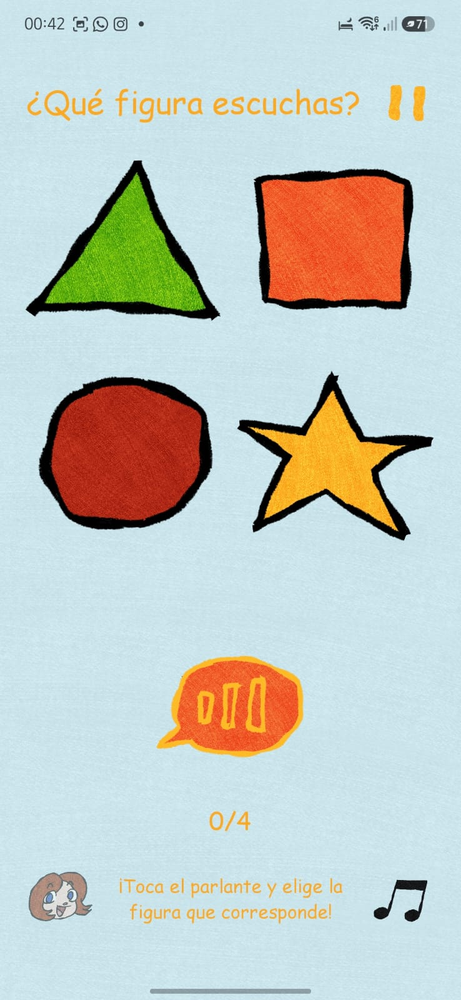
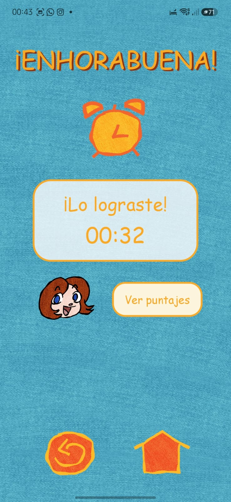
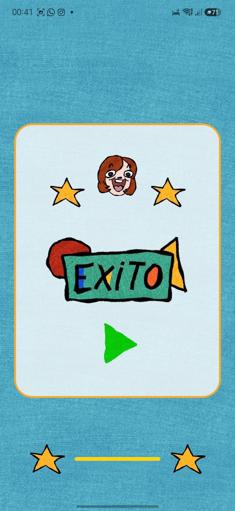

# FIGÚRALO 🎨🎮

**Figúralo** es una aplicación móvil educativa dirigida a niños pequeños, desarrollada con **React Native y Expo**. Su propósito es estimular habilidades como la memoria visual, la asociación de figuras y el reconocimiento de sonidos mediante una experiencia sencilla, colorida e interactiva.

La aplicación acompaña al jugador a través de tres minijuegos consecutivos y registra el tiempo total empleado para completar la partida. Al finalizar, el usuario puede consultar sus mejores puntajes y volver a jugar conservando su nombre.

---

## 📱 Características principales

* Registro del nombre del jugador antes de comenzar.
* Tres minijuegos educativos.
* Navegación secuencial entre actividades.
* Instrucciones visuales y auditivas.
* Música de fondo reproducida en bucle.
* Botón para activar o silenciar la música.
* Efectos de sonido para respuestas correctas.
* Pantalla de pausa con confirmación antes de abandonar.
* Cronómetro que descuenta el tiempo permanecido en pausa.
* Registro local de los resultados.
* Clasificación de los 10 mejores tiempos.
* Detección de nuevos récords.
* Posibilidad de volver a jugar con el mismo nombre y un cronómetro nuevo.
* Interfaz adaptada para niños con botones grandes, ilustraciones y colores llamativos.

---

## 🕹️ Minijuegos

### 1. Juego de memoria

El jugador debe encontrar las parejas de cartas iguales.

Las cartas se muestran inicialmente boca abajo. Cuando se seleccionan dos cartas:

* Si forman una pareja, permanecen descubiertas.
* Si no coinciden, vuelven a ocultarse.
* Cada pareja encontrada reproduce un sonido de respuesta correcta.

El minijuego termina cuando se descubren todas las parejas.

### 2. Juego de asociación

El jugador debe conectar cada figura ubicada en el lado izquierdo con su figura correspondiente en el lado derecho.

Las conexiones se realizan deslizando el dedo entre ambos elementos. Una conexión válida queda dibujada en pantalla y reproduce un sonido de confirmación.

El juego finaliza cuando todas las figuras han sido conectadas correctamente.

### 3. Juego de sonidos

El jugador escucha un audio y debe seleccionar la figura que representa correctamente ese sonido.

Cuando la respuesta es correcta:

* Se muestra una retroalimentación positiva.
* Se reproduce el efecto de sonido correspondiente.
* Se avanza a la siguiente ronda.

Al completar todas las rondas, el jugador accede a la pantalla de resultados.

---

## 🛠️ Tecnologías utilizadas

* **JavaScript**
* **React Native**
* **Expo**
* **React Navigation**
* **Expo AV**
* **AsyncStorage**
* **React Native SVG**
* **React Native Safe Area Context**

---

## 📦 Dependencias principales

```json
{
  "@react-native-async-storage/async-storage": "latest",
  "@react-navigation/native": "latest",
  "@react-navigation/native-stack": "latest",
  "expo": "latest",
  "expo-av": "latest",
  "react": "latest",
  "react-native": "latest",
  "react-native-safe-area-context": "latest",
  "react-native-screens": "latest",
  "react-native-svg": "latest"
}
```

---

## 📁 Estructura del proyecto

```text
SemestralDS6/
├── assets/
│   ├── audio/
│   ├── fonts/
│   └── img/
├── components/
│   ├── Card.js
│   ├── Footer.js
│   └── Header.js
├── context/
│   └── MusicContext.js
├── navigation/
│   └── StackNavigator.js
├── screens/
│   ├── AudioGameScreen.js
│   ├── ExitoScreen.js
│   ├── HomeScreen.js
│   ├── MatchGameScreen.js
│   ├── MemoryGameScreen.js
│   ├── PauseScreen.js
│   └── ResultScreen.js
├── storage/
│   └── storage.js
├── utils/
│   ├── gameData.js
│   ├── shuffle.js
│   ├── soundEffects.js
│   └── timer.js
├── App.js
├── app.json
├── index.js
├── package.json
└── README.md
```

---

## 🔄 Flujo de navegación

```text
Pantalla de inicio
        ↓
Juego de memoria
        ↓
Pantalla de éxito
        ↓
Juego de asociación
        ↓
Pantalla de éxito
        ↓
Juego de sonidos
        ↓
Pantalla de resultados
```

Desde los juegos también se puede acceder a la pantalla de pausa.

---

## 🚀 Instalación y ejecución

### Requisitos

Antes de comenzar, asegúrate de tener instalado:

* Node.js
* npm
* Expo Go en un dispositivo móvil, o un emulador de Android/iOS
* Git

### 1. Clonar el repositorio

```bash
git clone https://github.com/Jessz3/SemestralDS6.git
```

### 2. Entrar a la carpeta del proyecto

```bash
cd SemestralDS6
```

### 3. Instalar las dependencias

```bash
npm install
```

### 4. Iniciar el proyecto

```bash
npx expo start
```

También se pueden utilizar los siguientes comandos:

```bash
npm run android
npm run ios
npm run web
```

### 5. Abrir la aplicación

* Escanea el código QR con **Expo Go**.
* También puedes abrirla en un emulador de Android o iOS.
* El dispositivo móvil y la computadora deben estar conectados a una red compatible.

---

## 🎨 Créditos artísticos

Queremos expresar un agradecimiento especial a **[@acuaria21](https://www.instagram.com/acuaria21/)** por la creación de los recursos gráficos y assets utilizados en Figúralo.

Su trabajo artístico permitió desarrollar la identidad visual de la aplicación, incluyendo a **Figuralicia**, los botones, fondos, personajes, decoraciones y demás elementos que forman parte de la experiencia del juego.

> Los recursos gráficos de este proyecto fueron creados especialmente para Figúralo. No deben reutilizarse, distribuirse o modificarse fuera de este proyecto sin la autorización correspondiente de su artista.

---

## 🎬 Video promocional

**Enlace al video:**

```text
https://vt.tiktok.com/ZSX4pKtmb/
```
---

## 📸 Capturas de pantalla

### Pantalla de inicio



### Juego de memoria



### Juego de pareo



### Juego de sonidos



### Pantalla de resultados



### Pantalla de éxito



---

## 👥 Equipo de desarrollo

Proyecto desarrollado como trabajo semestral para la asignatura **Desarrollo de Software VI**.

### Integrantes

* Hou, Erick 8-1017-473
* Luo, Genesis 8-1020-1006
* Zheng, Jessica 8-1033-370

---

## 🎓 Contexto académico

* **Universidad:** Universidad Tecnológica de Panamá
* **Facultad:** Facultad de Ingeniería de Sistemas Computacionales
* **Asignatura:** Desarrollo de Software VI
* **Proyecto:** Aplicación móvil educativa
* **Año:** 2026

---

## 📄 Uso del proyecto

Este proyecto fue desarrollado con fines educativos y académicos.

El código fuente puede ser consultado como referencia para proyectos relacionados con React Native, navegación móvil, almacenamiento local, reproducción de audio y desarrollo de minijuegos.

Los assets visuales mantienen los créditos y restricciones indicados en la sección de créditos artísticos.

---

## 💛 Agradecimientos

Agradecemos a todas las personas que participaron en el diseño, desarrollo, pruebas y creación de contenido para Figúralo.

De manera especial, agradecemos nuevamente a **[@acuaria21](https://www.instagram.com/acuaria21/)** por dar vida a Figuralicia y a la identidad visual del proyecto.
